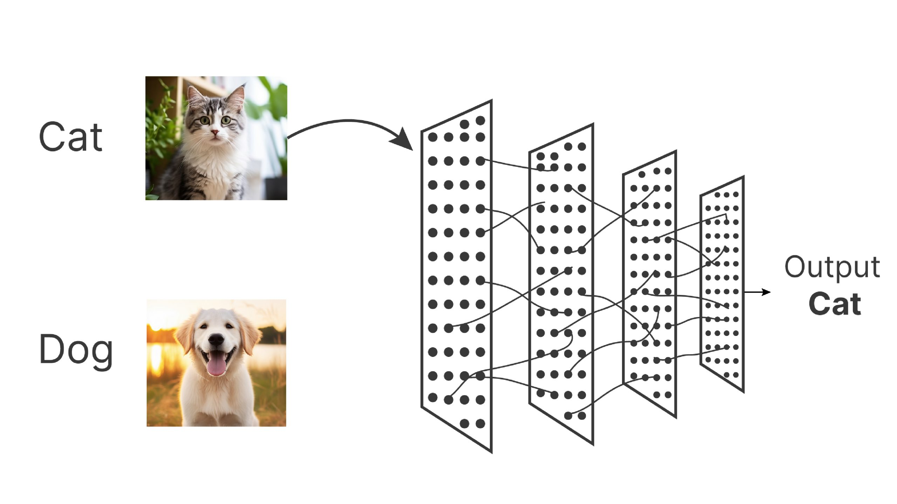

<h1>Animal Classification Model with Flask Visualization</h1>
 
<h2>Overview</h2>

This project is an Animal Classification Model built using a Convolutional Neural Network (CNN) architecture with transfer learning and data augmentation. The model achieves very high accuracy and can predict 15 different animal classes. It is integrated into a Flask web application with an API to provide an interactive user experience, allowing users to upload images and receive real-time predictions with confidence scores.
 
The app is designed to visualize the model's capabilities, making it easy for users to test and explore animal classification in a sleek, dark-themed UI with animations.

 
<h2>Features</h2>
<ol>
  <li><b>Model:</b> CNN with transfer learning (based on pre-trained model efficientNet) and data augmentation for robust performance.</li>
  <li><b>Accuracy:</b> Very high accuracy.(arround 100%) </li>
  <li><b>Classes:</b> Predicts 15 animal types </li>  
</ol>
 
<h1>Animal Classes</h1>

The model can classify the following 15 animals

 
<h1>Model Details</h1>
<ol>
  <li><b>Architecture:</b> CNN with transfer learning (based on EfficientNet, fine-tuned for animal classification).</li>
  <li><b>Training:</b> Utilized data augmentation (rotation, flipping, zooming) to improve generalization.</li>
  <li><b>Dataset:</b> Trained on a dataset of animal images.</li>
  <li><b>Accuracy:</b> Achieves very high accuracy (arround 100%).</li>
  <li><b>Output:</b> Predicts one of 15 animal classes with a confidence score (0%-100%).</li>
</ol>

The model weights are stored in 'static/animal_classifier_model.h5'

 
<h1>Contributing</h1>

Feel free to fork this repository, submit issues, or send pull requests. Contributions to improve the model, UI, or add new features are welcome!

 
<h1>Acknowledgments</h1>
<ol>
  <li>Built with inspiration from modern ML and web development practices.</li>
  <li>Thanks to the open-source community for tools like Flask and TensorFlow/PyTorch.</li>
</ol>
 
## Demo
Watch a quick demo of the app in action:

*Click the image above to see the video.*
<h5><i>
Created by Chamindu Senehas
</i></h5>
